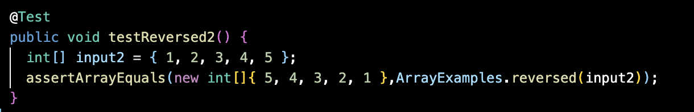
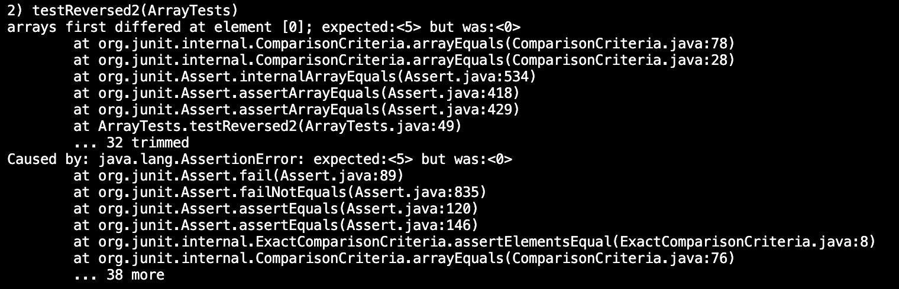
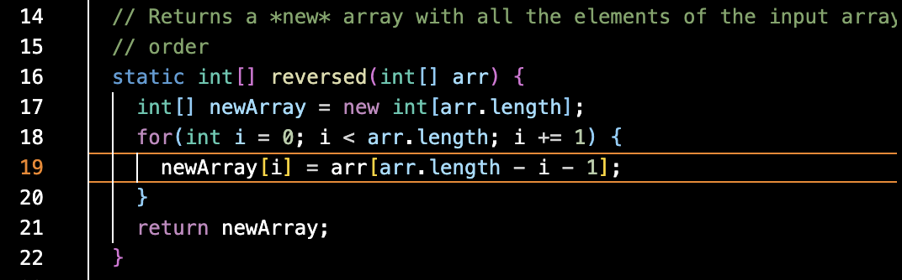
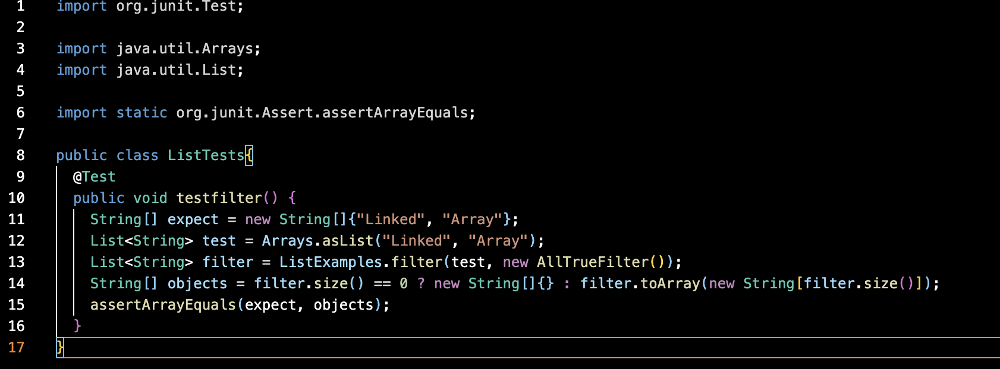
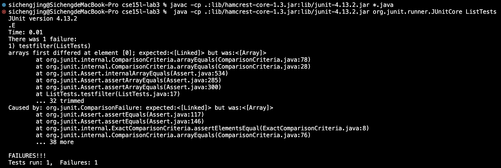
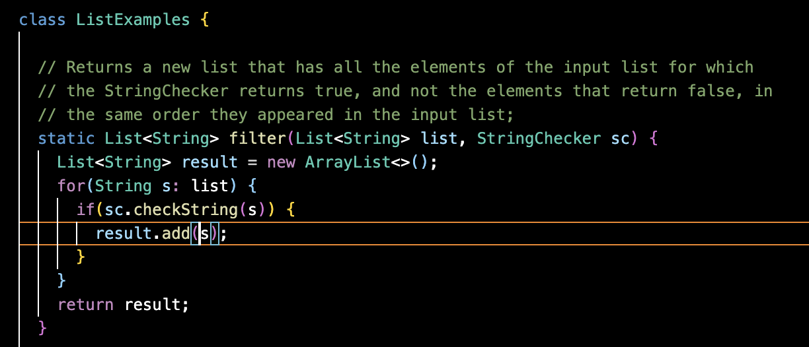

# Part 1

# Part 2
In the ArrayExamples.java, there is a bug in the reversed method. 

This image is the failure-inducing input. 

After running the test, the output shows that it failed. To be specific, the symptom is the new array does not include the reversed elements of the input. However, it only contains 0. So, I need to debug.

This image is the fixed code. I exchange the place of arr and newArray in line 19 and leave the others in this line unchanged. So, the last element of arr is the first item of newArray, and so on. Besides, I also change the return array into newArray.

In the given test example, because the input is empty, so the problem is not obvious. After adding elements to the input, we can find where the bug is. Before the modification, newArray is empty, so it cannot give values to arr. So, the order of elements in arr is not changed, but all elements become 0.

In the ListExamples.java, there is a bug in the filter method.

This image is the failure-inducing input. 

The output failed because the true result is not the same as the expected result. This is because every time a new string is added into the array, the string will add at index 0. So, the order of the elements will be reversed. Therefore, the output is ("Array", "Linked") but not ("Linked", "Array").

After revising the code, the string will add to the array in the normal order. 
